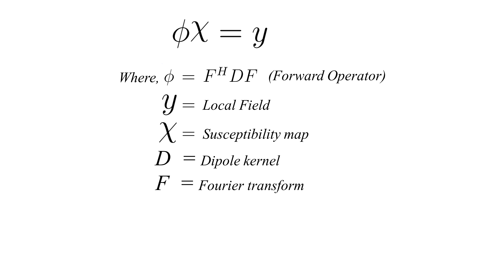
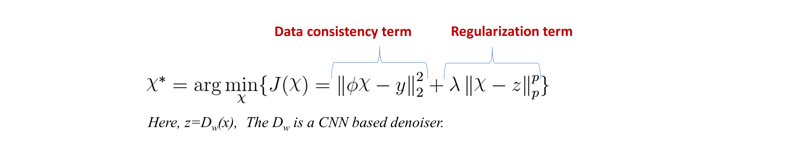
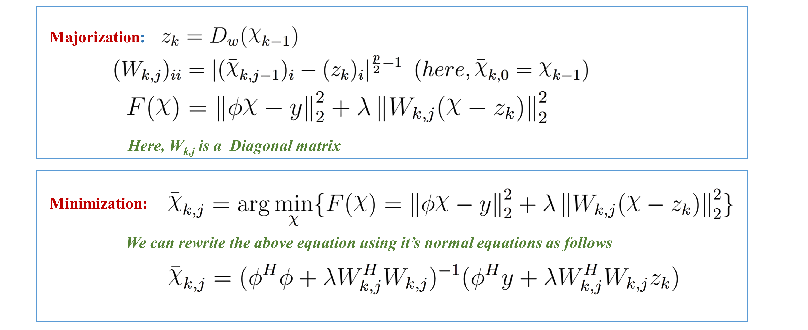
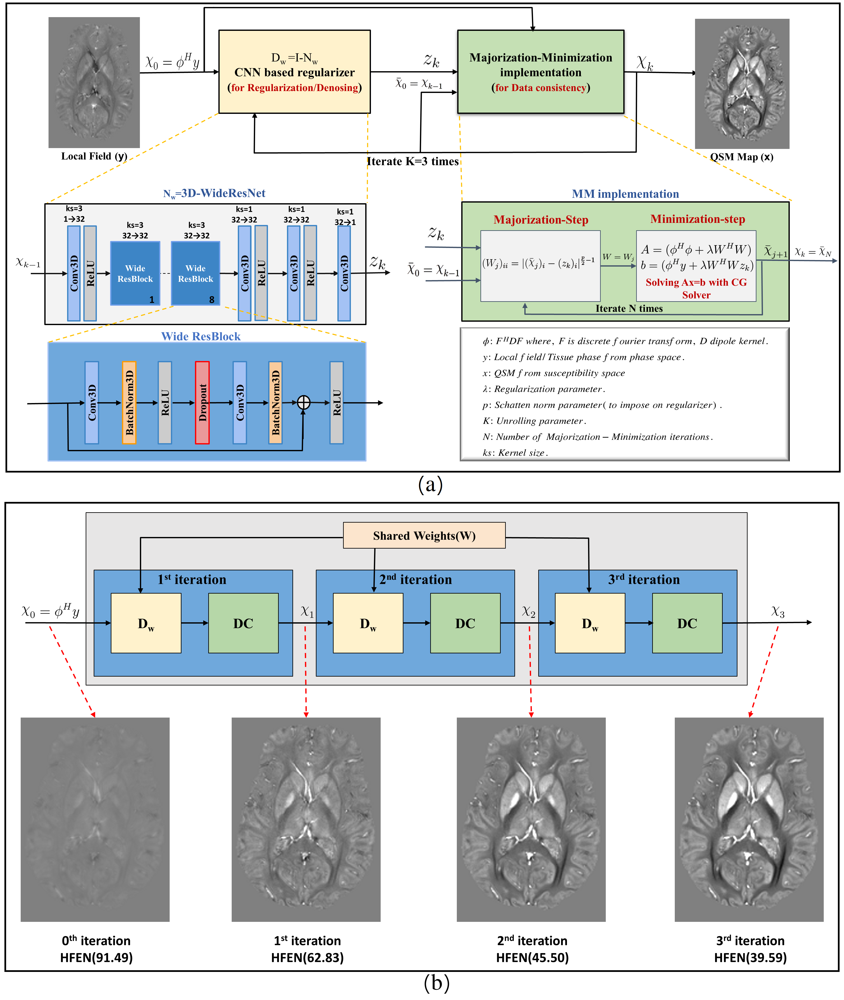
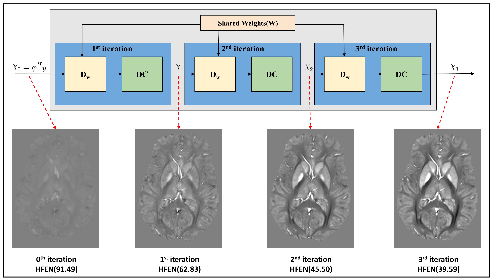
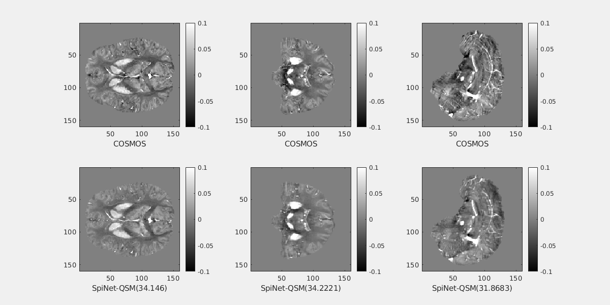
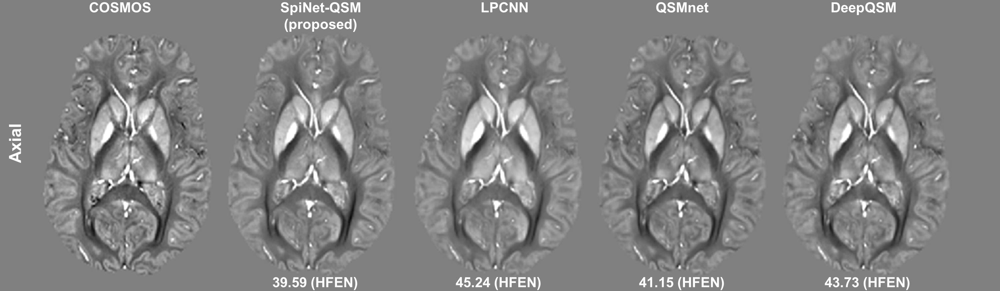
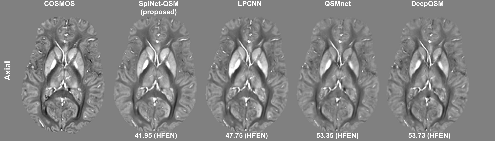

<html>
<head>
</head>
<body>

<left>
<h1>SpiNet QSM: Model-based Deep Learning with Schatten p‐norm regularization for QSM reconstruction </h1>
</left>
<h2> QSM problem</h2>
QSM provides information about the underlying magnetic susceptibility distribution of a sample from MRI phase measurements. It is useful in the clinical diagnosis of diseases  like Demyelination, Calcification, and Parkinson’s disease.
  
The mathematical relation for the QSM reconstruction is:

For solving QSM problem, it is required peform dipole deconvolution with local field. It is very cruical step in the QSM solving. Unfortunately, this it is an illposed problem.

# SpiNet-QSM 
The proposed SpiNet-QSM is a model-based deep learning technique for solving the QSM problem. The proposed approach can enforce p-norm $(0 < p ≤ 2)$ on trainable regularizer, where its norm parameter ($p$) is trainable (automatically chosen).

SpiNet-QSM has two parts: data consistency term and regularization term.

  
# SpiNet-QSM mathematical formulation
In this approach, QSM problem was formulated as the following optimization problem by enforcing p-norm at denoiser/regularization term.

In this equation, the norm parameter (**p**) of the regularization term and regularization parameter(**𝜆**) are learnable for the QSM problem. 

Here, $J(\chi)$ has been iteratively solved using the majorization-minimization approach. In the Majorization, the upper bound function $F(\chi)$ for $J(\chi)$ has been defined and in the minimization step $F(\chi)$ was solved.
  
The following equations defining the majorization and minimization step at $K^{th}$ iteration.

The above minimization equation has been solved using the CG algorithm. 
  
# SpiNet-QSM Architecture

# SpiNet-QSM as a unrolled architecture

# Sample QSM reconstruction on QSM-2016 challenge data
  

# SpiNet-QSM on complete training data

QSM maps reconstructed on complete training data were shown in the first row, and residual error maps in the second row.

  

# SpiNet-QSM on limited training data

QSM maps reconstructed on training limited data were shown in the first row, and residual error maps in the second row.   

  

# How to run the code
First, ensure that PyTorch 1.10 or higher version is installed and working with GPU. Second, just clone or download this reporsitory. The SpiNet_QSM_demo_run.py file should run without any changes in the code. 

We can run from the command prompt: **`python SpiNet_QSM_demo_run.py`**.
We can check the quality of the Spinet-QSM output by running the **`metrics_evaluation.m`**. It calculates the **`SSIM, pSNR, RMSE, HFEN`**.
# Dependencies
<li> Python  </li>  
<li> PyTorch 1.10 </li>
<li> MATLAB R2022b </li>
  
# Files description
**`savedModels:`** This directory contain's the learned PyTorch 1.10 model parameters. 

**`SpiNet_QSM_demo_run.py:`** It to read the model and run on the given demo input data from Data folder.

**`dw_WideResnet.py:`** This file contains the 3D-WideResNet(Residual learning CNN model) code for the denoiser($D_{w}$). 

**`loss.py:`** This file contains the code for the loss function. the $l_1$-norm of the voxel-wise difference (L1 loss term) and gradient-wise difference (edge loss) was utilized in a weighted manner.

**`utils.py:`** This file contains the code for many supporting functions for the previous Python code files.
# Contact

</body>
</html>
