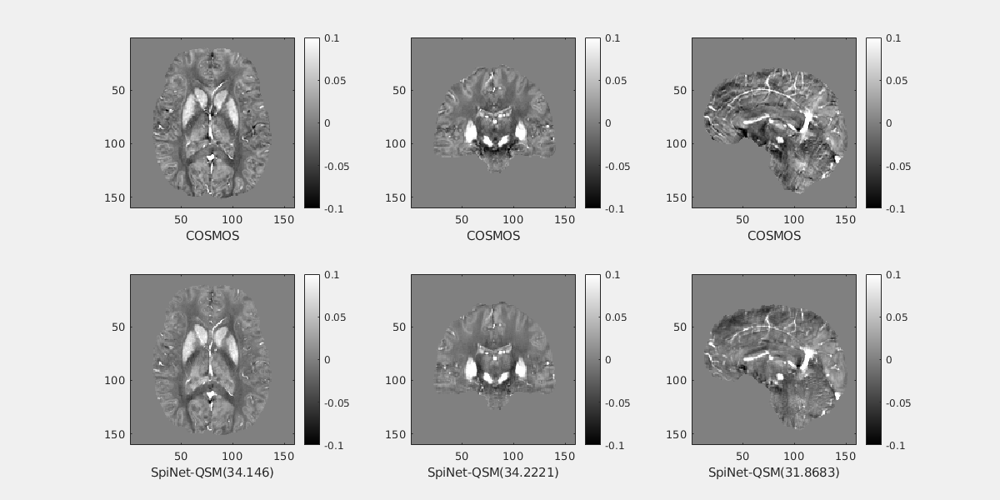

<html>
<head>
</head>
<body>

<left>
<h1>SpiNet QSM: Model-based Deep Learning with Schatten p‐norm regularization for QSM reconstruction </h1>
</left>
<h2> QSM problem</h2>
QSM provides information about the underlying magnetic susceptibility distribution of a sample from MRI phase measurements. It is useful in the clinical diagnosis of diseases  like Demyelination, Calcification, and Parkinson’s disease.
  
The mathematical relation for the QSM reconstruction is:

For solving QSM problem, it is required peform dipole deconvolution with local field. It is very cruical step in the QSM solving. Unfortunately, this it is an illposed problem.

# SpiNet-QSM 
The proposed SpiNet-QSM is a model-based deep learning technique for solving the QSM problem. The proposed approach can enforce p-norm $(0 < p ≤ 2)$ on trainable regularizer, where its norm parameter ($p$) is trainable (automatically chosen).

SpiNet-QSM has two parts: data consistency term and regularization term.

  
# SpiNet-QSM equations
In this approach, QSM problem was formulated as the following optimization problem by enforcing p-norm at denoiser/regularization term.

In this equation, the norm parameter (**p**) of the regularization term and regularization parameter(**𝜆**) are learnable for the QSM problem. 

Here, $J(\chi)$ has been iteratively solved using the majorization-minimization approach. In the Majorization, the upper bound function $F(\chi)$ for $J(\chi)$ has been defined and in the minimization step $F(\chi)$ was solved.
  
The following equations defining the majorization and minimization step at $K^{th}$ iteration.

The above minimization equation has been solved using the CG algorithm. 
  
# SpiNet-QSM Architecture

# SpiNet-QSM as a unrolled architecture

# Sample QSM reconstruction on QSM-2016 challenge data
  

# SpiNet-QSM on complete training data

# SpiNet-QSM on limited training data

</body>
</html>
